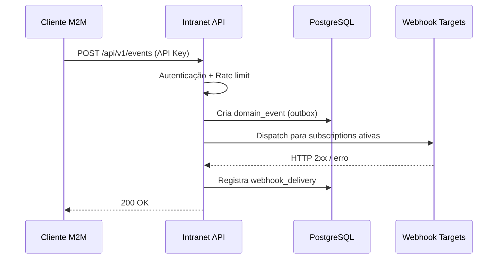

# PAGES.md — Intranet ASOF

Funcionalidades de cada página e requisitos para que sejam consideradas funcionais.

**Roles:** `admin` · `diretoria` · `secretaria`  
**Convenção de acesso:** `*` = qualquer autenticado · roles listadas = mínimo necessário

---

## Fluxo de autenticação

```mermaid
flowchart TD
    A([Usuário]) --> B{Tem sessão?}
    B -- não --> C[/login]
    B -- sim --> D{mustChangePassword?}
    D -- sim --> E[/change-password]
    D -- não --> F[/app]
    C --> G{Credenciais válidas?}
    G -- não --> C
    G -- sim --> D
    E --> F
    F --> H{Esqueceu a senha?}
    H -- sim --> I[/forgot-password]
    I --> J[/reset-password?token=...]
    J --> C
```

---

## Rotas Públicas

### `/`
Redireciona para `/login` (sem sessão) ou `/app` (com sessão).

**Funcional quando:** o redirect ocorre em < 100 ms sem piscar a página.

---

### `/login`

Autenticação via email + senha.

**Funcionalidades:**
- Validação de credenciais com bcrypt + dummy hash anti-enumeração
- Cookie de sessão `httpOnly` assinado com `SESSION_SECRET`
- Rate limit de 5 tentativas/15 min por IP (bloqueio com mensagem genérica)
- Redirect pós-login para destino original (query `?next=`)

**Funcional quando:**
- [ ] Login com credenciais corretas cria sessão e redireciona para `/app`
- [ ] Credenciais erradas exibem mensagem de erro sem vazar qual campo falhou
- [ ] Após 5 tentativas, exibe mensagem de bloqueio temporário
- [ ] Cookie expira corretamente após período configurado

---

### `/forgot-password`

Solicita token de reset por email.

**Funcionalidades:**
- Aceita email, envia link com token HMAC de uso único
- Resposta genérica independente de o email existir (anti-enumeração)

**Funcional quando:**
- [ ] Email válido registrado: recebe link de reset
- [ ] Email não registrado: resposta indistinguível do caso de sucesso
- [ ] Token expira após 1 hora

---

### `/reset-password`

Redefine senha via token da URL.

**Funcionalidades:**
- Valida token HMAC e expiry
- Aceita nova senha (mín. 8 chars) + confirmação
- Invalida token após uso

**Funcional quando:**
- [ ] Token válido: redireciona para `/login` após redefinição
- [ ] Token expirado ou inválido: exibe erro sem stack trace
- [ ] Reutilização de token: bloqueada

---

### `/change-password`

Troca obrigatória de senha para usuários com `mustChangePassword = true`.

**Funcionalidades:**
- Requer autenticação
- Valida senha atual antes de aceitar nova
- Limpa flag `mustChangePassword` ao concluir

**Funcional quando:**
- [ ] Usuário sem a flag é redirecionado para `/app`
- [ ] Senha atual errada: exibe erro
- [ ] Troca bem-sucedida: redireciona para `/app`

---

## Área Autenticada (`/app/*`)

Todas as rotas abaixo exigem autenticação. Usuário sem sessão é redirecionado para `/login`.

### Mapa de navegação

```mermaid
graph LR
    APP[/app<br/>Dashboard]
    ASSOC[/app/associados]
    ASSOC_ID[/app/associados/id]
    ASSOC_EDIT[/app/associados/id/editar]
    ASSOC_REL[/app/associados/relatorio]
    ATIV[/app/atividades]
    ATIV_NOVA[/app/atividades/nova]
    FIN[/app/financeiro/mensalidades]
    JUR[/app/juridico]
    JUR_LIST[/app/juridico/consultas]
    JUR_NOVA[/app/juridico/consultas/nova]
    JUR_ID[/app/juridico/consultas/id]
    TRIAGE[/app/email-triage]
    TRIAGE_ID[/app/email-triage/id]
    ETIQ[/app/etiquetas]
    SEARCH[/app/search]
    SEC_OF[/app/secretaria/oficios]
    SEC_OF_NOVO[/app/secretaria/oficios/novo]
    SEC_OF_EDIT[/app/secretaria/oficios/id/editar]
    SEC_DOC[/app/secretaria/documentos]
    SEC_EMAIL[/app/secretaria/emails/gerar]
    CFG[/app/config]
    CFG_USR[/app/config/usuarios]
    CFG_LOT[/app/config/lotacoes]
    CFG_AUD[/app/config/auditoria]
    CFG_WH[/app/config/integracoes/webhooks]
    CFG_API[/app/config/integracoes/api-keys]
    CFG_IA[/app/config/integracoes/ia]
    PRIV[/app/privacidade]

    APP --> ASSOC --> ASSOC_ID --> ASSOC_EDIT
    ASSOC --> ASSOC_REL
    APP --> ATIV --> ATIV_NOVA
    APP --> FIN
    APP --> JUR --> JUR_LIST --> JUR_ID
    JUR_LIST --> JUR_NOVA
    APP --> TRIAGE --> TRIAGE_ID
    APP --> ETIQ
    APP --> SEARCH
    APP --> SEC_OF --> SEC_OF_NOVO
    SEC_OF --> SEC_OF_EDIT
    APP --> SEC_DOC
    APP --> SEC_EMAIL
    APP --> CFG --> CFG_USR
    CFG --> CFG_LOT
    CFG --> CFG_AUD
    CFG --> CFG_WH
    CFG --> CFG_API
    CFG --> CFG_IA
    APP --> PRIV
```

---

### `/app` — Dashboard

**Acesso:** `*`

**Funcionalidades:**
- KPIs do quadro associativo: total de ativos, inadimplentes, pendentes de migração
- Atividades em aberto, atrasadas e urgentes
- Mini-kanban com contagem por status
- Top regiões de lotação
- Sidebar com perfil do usuário logado

**Funcional quando:**
- [ ] KPIs refletem dados reais do banco (não valores fixos)
- [ ] Atividades urgentes (vencidas) aparecem em destaque
- [ ] Página carrega em < 3 s com dados reais

---

### `/app/associados` — Lista de Associados

**Acesso:** `*`

**Funcionalidades:**
- Lista paginada (20/pág) de associados ativos
- Busca por nome (LIKE escapado)
- Link para perfil; link para editar visível apenas para admin/diretoria
- Botão para exportar relatório CSV (redireciona para `/app/associados/relatorio`)

**Funcional quando:**
- [ ] Busca retorna resultados parciais e é insensível a acentos
- [ ] Paginação navega corretamente sem perder o filtro de busca
- [ ] Usuário `secretaria` não vê o link de edição

---

### `/app/associados/[id]` — Perfil do Associado

**Acesso:** `*`

**Funcionalidades:**
- Dados de identificação: nome, CPF, SIAPE (mascarados para `secretaria`)
- Endereço, lotação, classe, situação funcional e contribuição
- Observações internas (visíveis apenas para `admin`)
- Atividades vinculadas
- Linha do tempo (adesão, última atualização)

**Funcional quando:**
- [ ] `secretaria` vê CPF e SIAPE mascarados (`***.***.***-**`)
- [ ] `admin` vê observações internas; demais roles não veem
- [ ] ID inexistente retorna página `not-found` (não erro 500)

---

### `/app/associados/[id]/editar` — Edição de Associado

**Acesso:** `admin`, `diretoria`

**Funcionalidades:**
- Formulário completo: identificação, endereço, dados administrativos, situação
- Validação de CPF, SIAPE, datas e emails
- Observações internas (somente `admin`)
- Auditoria automática ao salvar

**Funcional quando:**
- [ ] Dados inválidos (CPF malformado, email duplicado) bloqueiam o submit com mensagem específica
- [ ] Salvar redireciona para o perfil e exibe feedback de sucesso
- [ ] `secretaria` recebe 403 ao tentar acessar

---

### `/app/associados/relatorio` — Relatório CSV

**Acesso:** `admin`, `diretoria`

**Funcionalidades:**
- Seleção de campos com classificação LGPD por campo
- Filtros: situação funcional, associativa, contribuição, mês de aniversário
- Download CSV com BOM UTF-8
- Rate limit: 10 downloads/min por IP
- Audit log automático (LGPD)

**Funcional quando:**
- [ ] CSV gerado abre corretamente em Excel (BOM + separador `;`)
- [ ] Campos não selecionados não aparecem no arquivo
- [ ] 11ª requisição no mesmo minuto retorna 429

---

### `/app/atividades` — Quadro Kanban

**Acesso:** `*`

**Funcionalidades:**
- Cards por status: `backlog`, `em_andamento`, `em_revisao`, `concluida`
- Drag-and-drop entre colunas (atualiza posição e status)
- Filtros por responsável e por associado vinculado
- Contagem de cards por prioridade na coluna
- Quick-add de nova atividade inline

**Funcional quando:**
- [ ] Drag-and-drop persiste o novo status após recarregar a página
- [ ] Filtros combinados funcionam (responsável + associado)
- [ ] Card movido para `concluida` registra `completedAt`

---

### `/app/atividades/nova` — Nova Atividade

**Acesso:** `admin`, `diretoria`

**Funcionalidades:**
- Campos: título, descrição, status, prioridade, responsável, associado, data de vencimento
- Vinculação opcional a associado via `AssociatePicker`

**Funcional quando:**
- [ ] Título obrigatório é validado no cliente e no servidor
- [ ] Salvar redireciona para `/app/atividades` com o card visível na coluna correta

---

### `/app/financeiro/mensalidades` — Mensalidades

**Acesso:** `admin`, `diretoria`

**Funcionalidades:**
- Inicialização mensal: cria registros de pagamento para todos os associados ativos (`initializeMonthAction`)
- Tabela de pagamentos: status por associado (`em_dia`, `inadimplente`, `isento`)
- KPIs: total recebido, inadimplentes, isentos, taxa de adimplência
- Navegação mês a mês (anterior/próximo)
- Atualização individual de status de pagamento

**Funcional quando:**
- [ ] Inicialização cria exatamente um registro por associado ativo
- [ ] KPIs somam corretamente (sem dupla contagem)
- [ ] Navegação mensal mantém os dados do mês selecionado

---

### `/app/juridico` — Dashboard Jurídico

**Acesso:** `admin`, `diretoria`

**Funcionalidades:**
- Indicadores: consultas abertas, aguardando escritório, sem atualização > 7 dias, SLA vencendo em 48 h, respondidas no mês
- Lista de ações pendentes (ordenadas por urgência)
- Distribuição visual por status

**Funcional quando:**
- [ ] Contador "SLA vencendo" reflete consultas com `slaDeadline` nos próximos 2 dias
- [ ] Consultas stale (> 7 dias sem nota) aparecem destacadas

---

### `/app/juridico/consultas` — Lista de Consultas

**Acesso:** `admin`, `diretoria`

**Funcionalidades:**
- Paginação (20/pág)
- Busca por título ou número interno
- Filtro por status
- Destaque visual: stale (> 7 dias) e SLA vencido

**Funcional quando:**
- [ ] Busca funciona para número parcial (ex: `JUR-2026`)
- [ ] Filtro de status preserva-se ao navegar entre páginas

---

### `/app/juridico/consultas/nova` — Nova Consulta

**Acesso:** `admin`, `diretoria`

**Funcionalidades:**
- Campos: título, resumo, texto completo, associado, prazo SLA (dias)
- Número interno gerado automaticamente (JUR-YYYY-NNN sequencial)

**Funcional quando:**
- [ ] Número gerado é único e sequencial dentro do ano
- [ ] Prazo SLA calculado como `createdAt + slaDeadlineDays`
- [ ] Salvar redireciona para o detalhe da consulta criada

---

### `/app/juridico/consultas/[id]` — Detalhe de Consulta

**Acesso:** `admin`, `diretoria`

**Funcionalidades:**
- Dados completos da consulta (status, título, texto, associado, SLA)
- Histórico de notas em ordem cronológica
- Formulário para adicionar nova nota
- Atualização de status (dropdown com transições válidas)
- Painel lateral com resumo e SLA

**Funcional quando:**
- [ ] Nova nota aparece imediatamente no histórico após submit
- [ ] Mudança de status persiste após recarregar
- [ ] ID inexistente retorna página `not-found`

---

### `/app/email-triage` — Triagem de E-mails

**Acesso:** `admin`, `diretoria`

**Funcionalidades:**
- KPIs: total de emails, por status, taxa de conclusão
- Tabela paginada (20/pág) com filtros por status, prioridade e busca textual
- Ações em massa: validar, concluir, arquivar
- Classificação automática via Gemini AI (categoria, prazo, risco, ação recomendada)

**Funcional quando:**
- [ ] Filtros combinados (status + prioridade + texto) funcionam juntos
- [ ] Ação em massa atualiza status de todos os itens selecionados
- [ ] Busca textual funciona com blind indexes (não expõe PII em query)

---

### `/app/email-triage/[id]` — Detalhe de Triagem

**Acesso:** `*` (conteúdo PII visível para todos os autenticados)

**Funcionalidades:**
- Conteúdo completo do email (remetente, assunto, corpo)
- Classificação da IA com campos editáveis
- Observações internas e notas
- Atualização de status e deadline
- Audit log automático de acesso (LGPD)

**Funcional quando:**
- [ ] Audit log registrado a cada acesso ao conteúdo
- [ ] Atualização de status refletida na lista
- [ ] ID inexistente retorna página `not-found`

---

### `/app/etiquetas` — Etiquetas Pimaco

**Acesso:** `*`

**Funcionalidades:**
- Seleção de modelo Pimaco (presets configurados)
- Configuração de layout e conteúdo
- Geração de PDF via API (`POST /api/labels/pimaco`)
- Impressão via browser

**Funcional quando:**
- [ ] PDF gerado tem dimensões corretas para o modelo selecionado
- [ ] Download funciona sem erro 500

---

### `/app/search` — Busca Global

**Acesso:** `*`

**Funcionalidades:**
- Busca unificada por associados, oficios e consultas jurídicas
- Resultados agrupados por entidade
- Navegação direta para o item encontrado

**Funcional quando:**
- [ ] Retorna resultados de pelo menos uma entidade para termos válidos
- [ ] Resultados de entidades restritas (ex: jurídico) são filtrados por role

---

### `/app/secretaria/oficios` — Lista de Ofícios

**Acesso:** `admin`, `diretoria`, `secretaria`

**Funcionalidades:**
- Tabela paginada: número, destinatário, data, status
- Filtros por status e período
- Ações: visualizar, baixar PDF, editar, cancelar
- Download do PDF gerado (`GET /api/oficios/[id]/download`)

**Funcional quando:**
- [ ] PDF baixado segue o Padrão Ofício com numeração correta
- [ ] Ofício cancelado não pode ser editado (botão desabilitado)

---

### `/app/secretaria/oficios/novo` — Novo Ofício

**Acesso:** `admin`, `diretoria`, `secretaria`

**Funcionalidades:**
- Campos: destinatário, cargo, vocativo, assunto, setor Itamaraty
- Editor rich text para o corpo
- Fecho e signatário
- Número sequencial automático
- Sugestão de texto via IA Gemini (opcional, requer configuração)

**Funcional quando:**
- [ ] Número gerado é único e sequencial
- [ ] Salvar sem IA configurada funciona normalmente (IA é opcional)
- [ ] Campos obrigatórios validados antes do submit

---

### `/app/secretaria/oficios/[id]/editar` — Editar Ofício

**Acesso:** `admin`, `diretoria`, `secretaria`

**Funcionalidades:**
- Mesmo formulário do novo, com dados preenchidos
- Apenas ofícios com status não-cancelado podem ser editados

**Funcional quando:**
- [ ] Ofício cancelado retorna 404/not-found ao tentar editar
- [ ] Salvar redireciona para a lista com dados atualizados

---

### `/app/secretaria/documentos` — Documentos Institucionais

**Acesso:** `admin`, `diretoria`, `secretaria`

**Funcionalidades:**
- Upload com categorias: contrato, ata, oficio, rh, estatuto, etc.
- Lista paginada com busca por nome e filtro por categoria
- Download com URL assinada (expiração configurável)
- Exclusão com confirmação
- Vinculação opcional a entidade (associado, ofício, consulta)

**Funcional quando:**
- [ ] Upload de arquivo > 10 MB rejeita com mensagem clara
- [ ] URL de download expira após o período configurado
- [ ] Exclusão remove o arquivo do storage e o registro do banco

---

### `/app/secretaria/emails/gerar` — Gerador de E-mails com IA

**Acesso:** `admin`, `secretaria`

**Funcionalidades:**
- Seleção de tipo de email
- Prompt livre para instruções à IA (Gemini)
- Geração de assunto + corpo HTML
- Rate limit: integrado ao rate limiter por IP
- Requer `NEXT_PUBLIC_AI_ENABLED = true` e Gemini configurado

**Funcional quando:**
- [ ] Gemini não configurado: exibe mensagem de erro adequada (não 500)
- [ ] Resposta da IA exibe preview antes de qualquer envio
- [ ] Erros da API Gemini retornam mensagem genérica (sem vazar detalhes internos)

---

### `/app/config` — Hub de Configurações

**Acesso:** `admin`

Cards de navegação para sub-módulos: Usuários, Lotações, Auditoria, Webhooks, API Keys, IA.

**Funcional quando:**
- [ ] `diretoria` e `secretaria` recebem 403 ao tentar acessar

---

### `/app/config/usuarios` — Usuários Administrativos

**Acesso:** `admin`

**Funcionalidades:**
- Lista de admins: nome, email, role, status ativo/inativo
- Reset de senha (gera senha temporária, força `mustChangePassword`)
- Ativação/desativação de conta
- Audit log de todas as ações

**Funcional quando:**
- [ ] Admin não pode desativar a própria conta
- [ ] Senha temporária exige troca no próximo login

---

### `/app/config/lotacoes` — Lotações

**Acesso:** `admin`, `diretoria`

**Funcionalidades:**
- Cadastro com nome e tipo (`domestic`/`abroad`)
- Edição e ativação/desativação
- Validação de nome duplicado

**Funcional quando:**
- [ ] Nome duplicado bloqueado com mensagem específica
- [ ] Lotação desativada não aparece no `AssociatePicker`

---

### `/app/config/auditoria` — Auditoria

**Acesso:** `admin`, `diretoria`

**Funcionalidades:**
- Consulta paginada (50/pág) de `audit_logs`
- Filtros por ação, tipo de entidade e intervalo de datas
- Timestamps exibidos em `America/Sao_Paulo`

**Funcional quando:**
- [ ] Filtros combinados reduzem corretamente o conjunto de resultados
- [ ] Registro de ações sensíveis (edição de associado, reset de senha) está presente

---

### `/app/config/integracoes/webhooks` — Webhooks

**Acesso:** `admin`

**Funcionalidades:**
- Lista de subscriptions com URL e status
- Criação com `targetUrl` HTTPS pública (validação SSRF)
- Rotação de segredo HMAC
- Ativação/desativação

**Funcional quando:**
- [ ] URL privada (RFC-1918, localhost) é rejeitada na criação
- [ ] Segredo exibido apenas uma vez após criação/rotação

---

### `/app/config/integracoes/api-keys` — API Keys

**Acesso:** `admin`

**Funcionalidades:**
- Criação com escopos: `events:read`, `events:write`, `webhooks:manage`, `admin`
- Exibição única do segredo após criação
- Rotação e desativação

**Funcional quando:**
- [ ] Segredo não recuperável após fechar o modal de criação
- [ ] Chave desativada retorna 401 nas APIs

---

### `/app/config/integracoes/ia` — Configuração de IA

**Acesso:** `admin`

**Funcionalidades:**
- Status da integração Gemini (chave configurada ou não)
- Indicador visual de saúde

**Funcional quando:**
- [ ] Com `GEMINI_API_KEY` ausente: exibe aviso claro
- [ ] Com chave configurada: exibe status ativo

---

### `/app/privacidade` — Política de Privacidade

**Acesso:** `*`

Exibe política LGPD e canal de contato para exercício de direitos do titular.

**Funcional quando:**
- [ ] Página carrega sem erro para qualquer role autenticada

---

## APIs e Route Handlers

### Fluxo de integrações



### `GET /api/v1/health`
Health check autenticado para integrações M2M. Requer escopo `health:read` ou role `admin`/`diretoria`.

**Funcional quando:** retorna `{ status: "ok" }` com 200 em < 500 ms.

---

### `GET|POST /api/v1/events`
- `GET`: lista domain events pendentes
- `POST`: dispara eventos por ID ou processa fila pendente

Autenticação: API Key com escopos `events:read` / `events:write`. Rate limit por chave.

**Funcional quando:**
- [ ] Evento dispatched persiste `webhook_delivery` com resultado
- [ ] Evento inexistente retorna 404 estruturado

---

### `POST /api/v1/email-triage/process`
Processa emails da fila Gmail via Gemini AI. Requer `CRON_SECRET`.

**Funcional quando:** classificação persiste no banco e não expõe PII em logs.

---

### `GET /api/v1/cron/gmail-watch`
Renova subscription Gmail Watch (cron). Requer `CRON_SECRET`.

---

### `GET /api/v1/cron/lgpd-retention`
Executa rotina de retenção LGPD (anonimização/exclusão de dados vencidos). Requer `CRON_SECRET`.

**Funcional quando:** registros além do período de retenção são anonimizados sem falha silenciosa.

---

### `GET /api/v1/juridico/sla-warnings`
Emite notificações de SLA vencendo para consultas jurídicas. Requer `CRON_SECRET`.

**Funcional quando:** emite ao menos uma notificação por consulta com SLA em < 48 h, sem duplicatas.

---

### `POST /api/v1/gmail-webhook`
Recebe push notifications do Gmail (Pub/Sub). Valida payload e enfileira para triagem.

---

### `POST /api/v1/events/dispatch`
Endpoint alternativo para disparo manual de domain events.

---

### `POST /api/labels/pimaco`
Gera PDF de etiquetas Pimaco. Requer autenticação + role `admin`/`diretoria`/`secretaria`.

**Funcional quando:** PDF com dimensões corretas para o preset retornado em < 5 s.

---

### `GET /api/oficios/[id]/download`
Download do PDF de um ofício. Requer autenticação.

**Funcional quando:** PDF gerado segue o Padrão Ofício; ofício cancelado retorna 404.

---

### `POST /api/webhooks/assinafy`
Recebe eventos do serviço de assinatura digital Assinafy. Valida `X-Webhook-Secret`.

**Funcional quando:** payload inválido ou secret errado retorna 401 sem processar o evento.

---

## Requisitos Transversais

Estes requisitos se aplicam a todas as páginas e APIs:

| Requisito | Critério |
|---|---|
| **Autenticação** | Qualquer rota `/app/*` sem sessão redireciona para `/login` |
| **Autorização** | Role insuficiente retorna 403 (não 404 ou 500) |
| **Error boundaries** | Toda rota tem `error.tsx`; erros não expõem stack trace no browser |
| **Not-found** | Rotas dinâmicas com ID inválido têm `not-found.tsx` |
| **PII em logs** | Nenhum CPF, email, SIAPE em texto plano em `stdout`/`stderr` |
| **Audit log** | Criação, edição e exclusão de associados, usuários, ofícios e consultas são registrados |
| **Acessibilidade** | Formulários com `label` associado; navegação por teclado funcional |
| **Performance** | Páginas com dados reais carregam em < 3 s em conexão 4G |
