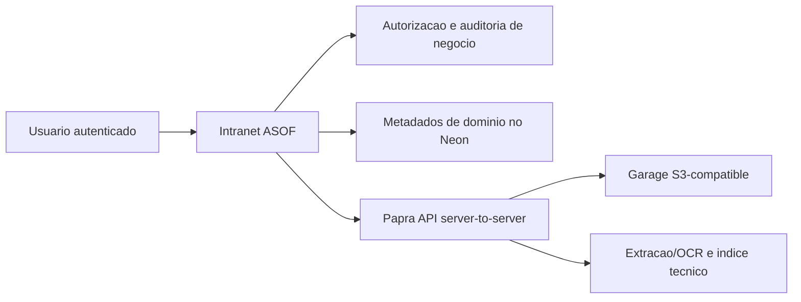

# ADR 012: Papra Como Candidato A DMS Externo Para Documentos

Status: accepted (emendado em 2026-07-18 — decisão de não seguir com o Papra registrada em `TODO-PROD.md` em 2026-07-08; a POC descrita abaixo não foi executada e não deve ser reaberta como gate de go-live)
Data: 2026-05-29

## Contexto

O ADR 008 manteve o modulo Documentos fora do dia 1 para nao atrasar o go-live com escolha de storage, URLs assinadas, retencao LGPD e smoke adicional. A necessidade permanece: a ASOF precisa arquivar Documentos institucionais, digitalizacoes, comprovantes, atas, estatutos, modelos e PDFs finais/assinados de Oficios, sem transformar o banco transacional da intranet em storage de arquivos.

## Decisao

Seguir com uma POC pos-estreia do Papra como DMS externo para Documentos da ASOF, sem bloquear o go-live e sem tornar o Papra a interface operacional principal.

A decisao e **go para POC controlada**, nao go para producao. O Papra atende aos criterios iniciais porque e open source/self-hostable, tem API autenticada, imagem Docker, storage configuravel com driver S3, extracao/OCR de conteudo e suporte documentado a criptografia de documentos. A intranet continua sendo o sistema de registro para dominio, metadados, autorizacao e auditoria; Papra fica limitado a armazenamento, OCR, indexacao, busca contextual e arquivamento tecnico dos arquivos.

Oficios continuam sendo criados, numerados e controlados pela intranet. Apenas o PDF final ou assinado pode ser arquivado como Documento. Usuarios acessam Documentos pelo contexto de negocio na intranet; Papra nao deve ser a interface operacional principal nem conceder acesso que a intranet negaria.

## Evidencias Consultadas

- Papra README: descreve Papra como plataforma minimalista de gerenciamento/arquivamento documental, com upload, busca full-text, autenticacao, self-hosting, tags, email ingestion e content extraction.
- Papra site: declara o ecossistema open source, self-hostable e licenciado em AGPL-3.0.
- Papra Docker docs: imagem `ghcr.io/papra-hq/papra:latest`, volume persistente em `/app/app-data` e `AUTH_SECRET` obrigatorio.
- Papra configuration docs: `DOCUMENT_STORAGE_DRIVER` aceita `filesystem`, `s3`, `in-memory` e `azure-blob`; `DOCUMENTS_CONTENT_EXTRACTION_ENABLED` habilita OCR/text extraction; `DOCUMENTS_OCR_LANGUAGES` configura idiomas OCR; `INTAKE_EMAILS_WEBHOOK_SECRET` protege webhooks.
- Papra API docs: acesso por `Authorization: Bearer YOUR_API_TOKEN`.
- Papra encryption docs: criptografia de documentos disponivel a partir da v0.9.0 com AES-256-GCM; a camada de criptografia fica entre Papra e o storage driver, incluindo S3.
- Garage README: Garage e um object store S3-compatible para self-hosting small-to-medium scale, AGPL-3.0, leve e resiliente.

Referencias:

- https://github.com/papra-hq/papra
- https://papra.app/en/
- https://docs.papra.app/self-hosting/using-docker/
- https://docs.papra.app/self-hosting/configuration/
- https://docs.papra.app/resources/api-endpoints/
- https://docs.papra.app/guides/document-encryption/
- https://github.com/deuxfleurs-org/garage

## Escopo Da POC

- Upload manual pela intranet como canal operacional inicial.
- Papra self-hosted em VPS isolada, com banco, storage e auth/admin separados da intranet.
- Papra nao deve ser exposto como interface publica; API/endpoint para a intranet e administracao via VPN ou allowlist de IP, sempre com TLS.
- Ingestao por email/webhook apenas como entrada tecnica para triagem.
- Chamadas da intranet para o Papra apenas no backend, com token de servico ou API key de escopo minimo guardado em ambiente server-side.
- Auditoria de negocio separada de logs tecnicos: a intranet registra quem acessou qual Documento e em qual contexto; chamadas tecnicas ao Papra ficam em logs com `requestId`, acao e resultado, sem conteudo sensivel.
- Ownership de metadados dividido: a intranet e canonica para metadados de dominio e autorizacao; o Papra e canonico para metadados tecnicos do arquivo.
- Documentos Vinculados e Documentos de Acervo, sem vinculos artificiais.
- Falha parcial de integracao nao cria Documento valido pela metade: se a intranet salvar metadados locais e o upload no Papra falhar, o registro fica em estado explicito de falha pendente, visivel apenas para `admin`/`secretaria`, com retry manual.
- Busca contextual por modulo/entidade, deixando busca global fora do primeiro desenho.
- Arquivamento/desativacao como fluxo normal; expurgo fisico apenas como excecao LGPD/erro grave restrita a `admin`, com motivo e auditoria.
- Storage privado open source e self-hosted escolhido para a POC: **Garage**, usando o driver S3 do Papra.
- Baseline operacional da POC com backup diario do banco por 14 dias, snapshot/versionamento do storage por 30 dias e restore simples testado ao menos uma vez em ambiente separado.
- A POC aceita a criptografia em repouso oferecida pelo stack/storage escolhido, desde que sua cobertura e seus limites fiquem documentados. Nao sera adicionada camada extra propria de criptografia nesta fase.

## Arquitetura Da POC

Regras de integracao:

- O browser nunca chama Papra diretamente.
- A intranet chama Papra apenas pelo backend com token/API key server-side de escopo minimo.
- A intranet e canonica para `papraDocumentId`, tipo de Documento, entidade relacionada opcional, autor, status, autorizacao e auditoria de negocio.
- Papra e canonico para metadados tecnicos do arquivo, OCR, hash, MIME, tamanho, storage path e timestamps tecnicos.
- Acesso direto a Papra deve ficar restrito por VPN, allowlist de IP ou rede privada; TLS e obrigatorio.
- Logs tecnicos registram `requestId`, acao e resultado, sem conteudo sensivel.
- Se upload no Papra falhar depois de metadado local criado, o Documento fica em estado explicito de falha (`pending_external_sync` ou `upload_failed`), visivel apenas para `admin`/`secretaria`, com retry manual.

## Riscos E Controles

- LGPD: Papra armazena documentos sensiveis; acesso precisa continuar mediado pela intranet e auditado por contexto de negocio.
- AGPL-3.0: Papra e Garage exigem revisao juridica/licenca antes de uso em producao, especialmente se houver modificacoes ou exposicao de servico a terceiros.
- Operacao: POC so e valida com backup diario do estado do Papra por 14 dias, snapshot/versionamento do storage por 30 dias e restore testado.
- Criptografia: habilitar criptografia de documentos do Papra na POC e validar que objetos no storage nao ficam legiveis como plaintext.
- OCR: content extraction melhora busca, mas nao deve ser base unica para classificacao juridica ou retencao.
- Email/webhook: pode entrar apenas como intake tecnico; nao cria Documento valido sem classificacao, autorizacao e auditoria da intranet.

## Opcoes Rejeitadas Por Agora

- Implementar storage/document management proprio dentro da intranet antes do go-live.
- Fazer Papra substituir Neon/PostgreSQL como banco transacional da intranet.
- Permitir upload operacional direto no Papra como fluxo normal.
- Criar busca global de Documentos antes de permissao e auditoria maduras.
- Usar servico proprietario gerenciado como backend da POC de storage.
- Usar MinIO como primeira escolha da POC: ainda e S3-compatible e conhecido, mas Garage se alinha melhor ao objetivo small-to-medium self-hosted e reduz dependencia de mudancas comerciais recentes no ecossistema MinIO.

## Consequencias

- A POC do Papra e frente pos-estreia e nao bloqueia o go-live.
- A issue de acompanhamento e https://github.com/prof-ramos/intranet/issues/93.
- A proxima issue de implementacao e https://github.com/prof-ramos/intranet/issues/116. Ela deve criar um spike tecnico sem dados reais: subir Papra + Garage em ambiente isolado, configurar API key, upload manual via backend da intranet, auditoria minima, falha parcial e restore simples.
- Uso em producao permanece bloqueado ate validar API/auth, storage, backups, restore, criptografia, LGPD e licencas.
