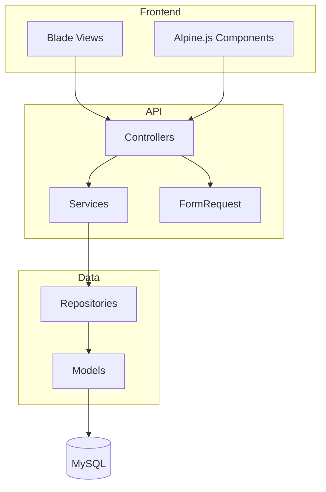

# Etapa 7 — Documentação com IA

> **Tempo estimado**: 1-2 horas
> **Saída**: Documentação completa (README, API, Deploy)

---

## Filosofia

> **"Código é para máquinas, documentação é para humanos."**

Documentação vibe coded = **gerada por IA, revisada por você**.

---

## 1. README.md

### Prompt para README

```
/claude "Gere README.md completo:

1. Título e descrição curta
2. Screenshot (placeholder)
3. Requisitos (PHP, extensions)
4. Instalação passo a passo
5. Configuração (.env)
6. Como executar
7. Estrutura de diretórios
8. Como contribuir
9. Licença

Use badges para status, versão, etc."
```

### Template Gerado

```markdown
# Intranet ASOF

[](https://github.com/.../actions)
[](https://php.net)
[](https://laravel.com)

Sistema administrativo para gestão de tarefas, contatos e documentos da ASOF.

## 📸 Screenshot


## 📋 Requisitos

- PHP >= 8.2
- Composer
- MySQL >= 8.0 ou PostgreSQL >= 13
- Node.js >= 18 (para assets)
- Extensions: mbstring, pdo, json, bcrypt

## 🚀 Instalação

```bash
# Clone
git clone https://github.com/.../intranet.git
cd intranet

# Instalar dependências
composer install
npm install

# Configurar
cp .env.example .env
php artisan key:generate

# Configurar banco no .env
# DB_DATABASE=intranet
# DB_USERNAME=seu_usuario
# DB_PASSWORD=sua_senha

# Migrar
php artisan migrate
php artisan db:seed

# Build assets
npm run build

# Executar
php artisan serve
```

Acesse `http://localhost:8000`

## 🔧 Configuração

### Google Workspace (Opcional)

Para integração com Drive:

```bash
# No .env
GOOGLE_CLIENT_ID=seu_client_id
GOOGLE_CLIENT_SECRET=seu_secret
GOOGLE_DRIVE_FOLDER_ID=pasta_id
```

## 📁 Estrutura

```
app/
├── Actions/         # Ações single-purpose
├── Enums/           # Enums de domínio
├── Services/        # Lógica de negócio
├── Repositories/    # Acesso a dados
└── Http/            # Controllers, Requests
```

## 🧪 Testes

```bash
# Todos os testes
pest

# Com cobertura
pest --coverage

# Parallel
pest --parallel
```

## 📝 Licença

MIT
```

---

## 2. Documentação de API

### Prompt para API Docs

```
/claude "Gere documentação de API OpenAPI 3.0:

1. Endpoint /api/tasks
2. Endpoint /api/tasks/{id}
3. Endpoint /api/tasks/{id}/status
4. Schemas de request/response
5. Exemplos de erro

Use formato YAML compatível com Swagger."
```

### Exemplo

```yaml
# docs/openapi.yaml
openapi: 3.0.0
info:
  title: Intranet ASOF API
  version: 1.0.0
paths:
  /api/tasks:
    get:
      summary: Lista tarefas
      parameters:
        - name: status
          in: query
          schema:
            type: string
            enum: [todo, progress, review, done]
      responses:
        '200':
          description: Lista paginada
          content:
            application/json:
              schema:
                type: object
                properties:
                  data:
                    type: array
                    items:
                      $ref: '#/components/schemas/Task'
    post:
      summary: Cria tarefa
      requestBody:
        required: true
        content:
          application/json:
            schema:
              $ref: '#/components/schemas/CreateTaskRequest'
      responses:
        '201':
          description: Tarefa criada
          '422':
            description: Validação falhou
  /api/tasks/{id}:
    get:
      summary: Detalhes da tarefa
      parameters:
        - name: id
          in: path
          required: true
          schema:
            type: integer
    patch:
      summary: Atualiza tarefa
    delete:
      summary: Remove tarefa

components:
  schemas:
    Task:
      type: object
      properties:
        id:
          type: integer
        title:
          type: string
        status:
          type: string
          enum: [todo, progress, review, done, blocked]
        priority:
          type: string
          enum: [low, normal, high, urgent]
        deadline:
          type: string
          format: date-time
    CreateTaskRequest:
      type: object
      required:
        - title
        - deadline
        - priority
      properties:
        title:
          type: string
          maxLength: 255
        description:
          type: string
          nullable: true
        deadline:
          type: string
          format: date-time
        priority:
          type: string
          enum: [low, normal, high, urgent]
```

---

## 3. Documentação de Deploy

### Prompt para Deploy Guide

```
/claude "Gere guia de deploy:

1. Pré-produção (backup, testes)
2. Build de assets
3. Configurações de produção
4. Migrations
5. Cache clearing
6. Supervisor (queue workers)
7. Cron jobs
8. Rollback manual"
```

### Exemplo

```markdown
# Deploy Guide

## Pré-Deploy

### Checklist

- [ ] Todos os testes passando
- [ ] Backup do banco atual
- [ ] Branch `main` atualizada
- [ ] Changelog atualizado

## Deploy em Produção

### 1. SSH no servidor

\`\`\`bash
ssh usuario@servidor
cd /var/www/intranet
\`\`\`

### 2. Pull e instalação

\`\`\`bash
git pull origin main
composer install --no-dev --optimize-autoloader
npm ci --production
npm run build
\`\`\`

### 3. Configurações

\`\`\`bash
# Verificar .env
php artisan config:cache
php artisan route:cache
php artisan view:cache
\`\`\`

### 4. Migrations

\`\`\`bash
php artisan migrate --force
\`\`\`

### 5. Otimizações

\`\`\`bash
# Clear caches
php artisan cache:clear

# Rebuild cache
php artisan config:cache
php artisan route:cache
\`\`\`

### 6. Serviços

\`\`\`bash
# Restart queues
sudo supervisorctl restart intranet-queue:*

# Restart PHP-FPM
sudo systemctl restart php8.2-fpm
\`\`\`

## Rollback

Se algo der errado:

\`\`\`bash
git revert HEAD
php artisan migrate:rollback --force
php artisan config:cache
\`\`\`
```

---

## 4. Changelog

### Prompt para Changelog

```
/claude "Gere CHANGELOG.md baseado nos commits:

1. Versões com datas
2. Categorias: Added, Changed, Fixed, Removed
3. Links para issues/PRs
4. Seguir Keep a Changelog"

Use commits do git como fonte."
```

### Exemplo

```markdown
# Changelog

## [1.2.0] - 2025-03-15

### Added
- Filtro de tarefas por responsável (#123)
- Exportação de CSV em /api/tasks/export (#125)
- Notificação por email ao completar tarefa (#127)

### Changed
- Melhor performance em listagem de tarefas
- Atualizado para Laravel 11.2

### Fixed
- Bug ao atualizar status de tarefa concluída (#130)
- Validação de deadline aceitando datas passadas (#132)

## [1.1.0] - 2025-02-20
...
```

---

## 5. Contributing Guide

### Prompt para Contributing

```
/claude "Gere CONTRIBUTING.md:

1. Como configurar ambiente dev
2. Padrões de código (PSR-12)
3. Flow de pull requests
4. Padrões de commit
5. Como rodar testes localmente"
```

### Exemplo

```markdown
# Contribuindo

## Setup

1. Fork o projeto
2. Clone seu fork
3. `composer install && npm install`
4. `cp .env.example .env && php artisan key:generate`
5. `php artisan migrate:fresh --seed`

## Desenvolvimento

### Padrões

- PSR-12 para código
- pt_BR para comentários e mensagens
- PHP 8.2+ features quando aplicável

### Commits

\`feat: add task filtering by status\`
\`fix: validate deadline is future\`
\`docs: update README with new features\`

### Pull Requests

1. Branch descritivo: \`feat/task-filtering\`
2. Descreva mudanças no PR
3. Todos os testes passando
4. Sem conflitos com main
```

---

## 6. Diagramas com IA

### Arquitetura

```
/claude "Gere diagrama Mermaid para arquitetura:

- Frontend (Blade/Alpine)
- API (Controllers/Services)
- Data Layer (Repositories/Models)
- Database (MySQL)

Use C4 simplificado."
```

### Exemplo



---

## 7. Scripts de Documentação

### Gerar Automaticamente

```bash
#!/bin/bash
# docs/generate.sh

# API docs
php artisan api:generate --force > docs/api.html

# Diagrama de models
php artisan model:diagram > docs/models.mmd

# Rotas
php artisan route:list --json > docs/routes.json

# OpenAPI
php artisan openapi:generate > docs/openapi.yaml
```

---

## Checklist Final

- [ ] README.md completo
- [ ] API documentada (OpenAPI)
- [ ] Deploy guide claro
- [ ] Changelog mantido
- [ ] Contributing guide
- [ ] Diagramas gerados
- [ ] Screenshots/atualizados

---

## Saída Esperada

- [ ] `README.md` no root
- [ ] `docs/api/` com OpenAPI
- [ ] `docs/deploy.md` detalhado
- [ ] `CHANGELOG.md` versionado
- [ ] Diagramas em `docs/diagrams/`
- [ ] Scripts de geração de docs

---

**Versão**: 1.0
**Data**: 2025-03-18

**Próxima**: [09-entrega.md](./09-entrega.md)
